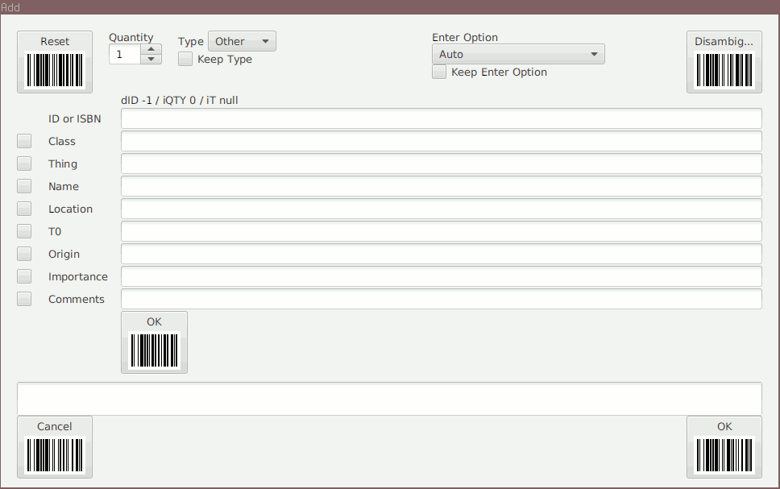

Introduction
============

The _Ma_Sys.ma Inventory_ software allows you to manage a little
(say up to 2000 items or so) inventory of arbitrary items. Major differences
to other inventory software include:

Simple Data Store / Minimality
:   All inventory data is stored in a single SQLite database table.
    This allows you to interface with the data using external software e.g.
    Libreoffice Base, SQLite browser or the `sqlite3` command. By this design,
    the features available are tightly limited.
    See _Fields and Database Structure_ for details.

Terminal user Interface (TUI) and Barcode Scanner support
:   Similar to other Ma_Sys.ma programs, the inventory is intended to run in
    a terminal emulator. Additionally, being related to inventory management,
    it is designed to interface with a barcode scanner. If the scanner supports
    2D datamatrix codes, parts of the user interface can be controlled by
    scanning the codes appearing on the screen. As a result, a keyboard (for
    data entry) and a barcode scanner (for everything else) is sufficient to
    use the inventory efficiently. There is limited support for printing
    barcodes provided by a separate script. See _Workflow_ for
    details on how this is intended to be used.

Structure by Autocomplete
:   Most inventory software supports keeping the individual items in categories.
    The Ma_Sys.ma implementation does this as well but does not require the
    categories to be predefined. Instread, it suggests existing categories for
    autocompletion as a means to re-use previously entered categories.

The mailing list discussion which led to the creation of the software presented
here starts at <https://lists.debian.org/debian-user/2020/02/msg00730.html>.

## Alternatives

As an alternative, you might want to consider
[partkeepr](https://partkeepr.org/) which is more fully-featured compared to the
Ma_Sys.ma Inventory.

Getting Started
===============

Most parts of the software are written in Perl and thus do not need any
compilation. The Java-parts are found in directory `ma_inventory_barcodegensvg`
and can be compiled by running `ant`.

In case you want to generate a Debian package (recommended), build it by
running `ant package` in the repository's top-level directory. Dependencies are
described in `build.xml`.

The inventory software consists of three scripts:

`ma_inventory_init` (`ma_inventory_init.pl`)
:   Database initialization routine.
`ma_inventory` (`ma_inventory.pl`)
:   Main and interactive part of the application.
`ma_inventory_export_to_pdf`
:   Barcode PDF export script. This requires a working pdfLaTeX installation.

Before running the interactive terminal user interface, a database has to be
created. To do this, invoke `ma_inventory_init` as described in the next
section.

Database Initialization (`ma_inventory_init`)
=============================================

## Name

`ma_inventory_init` -- Create SQlite3 database for use with Ma_Sys.ma Inventory.

## Synopsis

	ma_inventory_init DBFILE [CSVFILE]

## Description

This script takes as input a file name `DBFILE` to write the datbase to and
optionally a CSV file `CSVFILE` to populate the new database with.

The CSV file is expected to have a structure as can be exported from the legacy
Ma_Sys.ma Inventory v1 with the following fields semicolon-separated and without
quotation and escape characters:

	ID or ISBN;Quantity;Type;Author;Title;Year;Publisher;Publisher Location;Pages;Class;Thing;Name;Location;T0;Origin;Importance;Comments

Note that the ID and Quantity columns are expected to always be populated
whereas the other columns can be missing depending on the object type --
the legacy inventory made a distinction between books and other objects, hence
there are some book-specific fields.

## Example

A typical invocation to create a new and empty inventory may look like this:

	ma_inventory_init inventory.sqlite

This creates file `inventory.sqlite` with the necessary database but without any
inventory items yet.

Terminal User Interface (`ma_inventory`)
========================================

Once a database file is present, it can be opened with the interactive interface
provided by `ma_inventory`. For instance, it can be launched as
`ma_inventory inventory.sqlite`. For an empty inventory, it will then present
a screen as follows:

## The Table screen

~~~
ID Qty Class Thing Loc Imp                                                      

1 GenID 2 ARCL                                 8 Delete         0 Exit
~~~

For now, one can see the table headings (ID, Qty, Class, Thing, Loc, Imp), an
empty space and usage instructions in the last line. The usage instructions
consist of the last digit of the function key to press to invoke them.

This view is the _table_ screen which presents a table of all inventory items.
As the database was initially empty, the screen is empty as well.

The _ARCL_ function is explained in the next section, the other functions are
as follows:

`1 GenID`
:   By pressing [F1], one can open a dialog to generate 128 IDs in the database.
    These are intended to be suitable for barcode printing. While it is not
    necessary to have the values of barcodes predefined in the database, it
    provides an additional layer of safety against certain errors e.g. adding
    the same item twice by different barcodes etc. The use and effect of the
    function can be seen in the following two screens.

Generation question:

~~~
ID Qty Class Thing Loc Imp

           ┌───────────────────────────────────────────────────────┐
           │                                                       │
           │ ┌───────────────────────────────────────────────────┐ │
           │ │Generate 128 IDs from 1041000000000000 exclusive?  │ │
           │ └───────────────────────────────────────────────────┘ │
           │                                                       │
           │                                        < Yes > < No > │
           │                                                       │
           └───────────────────────────────────────────────────────┘

1 GenID 2 ARCL                                 8 Delete         0 Exit
~~~

After generating the IDs:

~~~
ID               Qty Class Thing Loc Imp                                        
1041000000000001 0
1041000000000002 0
1041000000000003 0
1041000000000004 0
1041000000000005 0
1041000000000006 0
1041000000000007 0
1041000000000008 0
1041000000000009 0
1041000000000010 0
1041000000000011 0
1041000000000012 0
1041000000000013 0
1041000000000014 0
1041000000000015 0
1041000000000016 0
1041000000000017 0
1041000000000018 0
1041000000000019 0
1041000000000020 0
1041000000000021 0
1041000000000022 0
1 GenID 2 ARCL                                 8 Delete         0 Exit
~~~

`8 Delete`
:   Deletes the currently selected item from the table. By default, the headings
    are selected (and [F8] does nothing). If the state from the sample
    screen before is used and item 1041000000000005 is selected, after [F8], the
    screen looks as follows (i.e. item 1041000000000005 is now missing):

~~~
ID               Qty Class Thing Loc Imp
1041000000000001 0
1041000000000002 0
1041000000000003 0
1041000000000004 0
1041000000000006 0
1041000000000007 0
1041000000000008 0
1041000000000009 0
1041000000000010 0
1041000000000011 0
1041000000000012 0
1041000000000013 0
1041000000000014 0
1041000000000015 0
1041000000000016 0
1041000000000017 0
1041000000000018 0
1041000000000019 0
1041000000000020 0
1041000000000021 0
1041000000000022 0
1041000000000023 0
1 GenID 2 ARCL                                 8 Delete         0 Exit
~~~

`0 Exit`
:   Pressing [F10] exits the application.

## Adding entries -- The Add/Edit/Recall (ARCL) screen

To add a new entry, press [F2] which should open the following screen, known
as the Add/Edit/Recall screen or shortened _ARCL_.

~~~
█▀█▀█▀█▀█▀██       On Enter   [Auto         ]                       █▀█▀█▀█▀█▀██
█ ▀ ██▃██▀▃█                                                        █ ▀▃██ ▀█▀▃█
█ ▀   ▃ █▀▃█       Status     DISSOC dID=-1 iQTY=0                  █  ▀ ████▀▃█
█ ▀ ▀ █▀▃▀▃█                                                        █ ██▃    █▃█
█ █ ▃██▃▃▀▃█       ID         #___________________________________  █ ▀▀▃██▀▃█▃█
█▃▃▃▃▃▃▃▃▃▃█                                                        █▃▃▃▃▃▃▃▃▃▃█
 Reset (F9)        Quantity   ____________________________________   Recall (F7)

              [ ]  Class      ____________________________________

              [ ]  Thing      ____________________________________

              [ ]  Location   ____________________________________

              [ ]  T0         ____________________________________

              [ ]  Origin     ____________________________________
Cancel (F10)                                                           OK (F4)
█▀█▀█▀█▀█▀██  [ ]  Importance ____________________________________  █▀█▀█▀█▀█▀██
█ ▀▃██▃ ▀▀▃█                                                        █ ▀ █▀▃█▀▃▃█
█  ▀█ █ █▀▃█  [ ]  Comments   ____________________________________  █ ▀███▀▃█▀▃█
█ ▀▀▀▃██ █▃█                  ____________________________________  █ ▀▀ █▀█ █▃█
█  ▀▃████▃▃█                  ____________________________________  █ ▃ ▃█▃▀ ▀▃█
█▃▃▃▃▃▃▃▃▃▃█                  ____________________________________  █▃▃▃▃▃▃▃▃▃▃█
~~~

Note: If the codes look inverted, consider setting the text display to
white on black because that is what they are intended to be seen on. If they are
displayed correctly, there is a bright outline around each of the codes and each
of them has a distinctive black L-form.

The screen is organized as follows:

 * The first two lines (“On Enter” and “Status”) contain control information
   (see _Status_ and _On Enter_ for a description)
 * The remaining lines provide a form which allows for data entry and
   editing. Each line is prefixed by a checkbox (see _Keep_ for details)
 * The columns on the left and on the right display the distinctive
   _inventory actions_ and the function key to invoke them along with a
   DataMatrix code which triggers the respective action upon being scanned.

### Inventory Actions

The inventory actions provided on the ARCL screen are as follows:

Reset (F9)
:   Clears all fields and switches the screen to state DISSOC.

Recall (F7)
:   Checks the database for matching entries (in terms of the fields as
    entered) and associates them if there is exactly a single match. If there
    are multiple matching entries, this opens the _disambiguate_ screen. This
    is intended to cover most searching needs.

Cancel (F10)
:   Returns to the table screen without saving the current changes.

OK (F4)
:   Saves the current changes and invokes Reset afterwards as to provide space
    to enter the next item or switch back to the table screen without losing
    data.

### Status

The status line consists of three parts:

 1. `DISSOC` or `ASSOC`:
    `ASSOC` indicates that the current entry is known in the database and
    being edited. `DISSOC` indicates that the current entry is being newly
    considered new. In case it exists in the database, it is possible to
    asscoiate it by invoking the Recall (F7) function.
 2. `dID=-1`: The number after the `=` sign is either the database's internal
    ID or `-1` if the entry is not associated (`DISSOC`).
 3. `iQTY=0`: The number after the `=` is the quantity associated to the current
    entry in the database. In case it is `0`, the inventory software
    automatically assumes that by editing, this item becomes available at least
    once and thus presets the editable “Quantity” line to 1. In case you want
    to edit an item which remains at quantity 0, you need ot change the
    “Quantity” line back to 0 and `iQTY` can serve as a reminder of this
    necessity.

### On Enter

~~~
On Enter   [Auto         ]
           ┌─────────────┐
Status     │Auto         │
           │Recall       │
ID         │OK           │
           │Autocomplete │
Quantity   │Nothing      │
           └─────────────┘
~~~

The _On Enter_ dropdown menu configures which action is to be performed if
the [ENTER] key is pressed in any of the lines. The meanings of the choices
are explained in the following:

Auto
:   When [ENTER] is pressed in the _ID_ line, invoke Recall (as if F7 were
    pressed). When [ENTER] is pressed in another line, invoke Autocomplete.
Recall
:   When [ENTER] is pressed, invoke Recall.
OK
:   When [ENTER] is pressed, invoke OK (save entry and clear fields).
Autocomplete
:   When [ENTER] is pressed in the _ID_ line, do nothing.
    When [ENTER] is pressed in another line, invoke Autocomplete.
Nothing
:   Do not assign any action to [ENTER].

It is expected that most of the time, the _Auto_ behaviour is acceptable.
A notable special case for selectiong _Autocomplete_ is if you scan barcodes
which are not registered in the database yet. With _Auto_, an automatic
Recall will fail, opening an information dialog whereas with _Autocomplete_, no
Recall will be attempted.

### Keep

The lines _Class, Thing, Location, T0, Origin, Importance_ and _Comments_ are
prefixed by a checkbox. If you tick the box, the value entered there will
persist even after pressing _OK_ and thus be “copied“ for the next entry. This
makes sense, if you want to e.g. add a lot of items from the same location, same
class, with the same comments etc. The _On Enter_ action is always kept, whereas
ID and Quantity are always reset to empty or 1 respectively.

### Autocompletion

If the window is higher than 25 characters upon starting the inventory
application, a list will be displayed below the _Comments_ lines. This list
automatically suggests entries which match the prefix entered in the current
line from existing database entries. This is possibly most useful for completing
the _Class_ field as to assign similar classes to similar things.

If it is visible, you can navigate the autocompletion results by using the
[UP] and [DOWN] arrow keys. To actually perform the autocompletion, the
_On Enter_ action needs to be either _Auto_ or _Autocomplete_. In these cases,
it is sufficent to press [ENTER] to autocomplete.

Assuming there are some entries present in the database already, the
autocomplete suggestions may look as follows:

~~~
█▀█▀█▀█▀█▀██       On Enter   [Auto         ]                       █▀█▀█▀█▀█▀██
█ ▀ ██▃██▀▃█                                                        █ ▀▃██ ▀█▀▃█
█ ▀   ▃ █▀▃█       Status     DISSOC dID=-1 iQTY=0                  █  ▀ ████▀▃█
█ ▀ ▀ █▀▃▀▃█                                                        █ ██▃    █▃█
█ █ ▃██▃▃▀▃█       ID         ____________________________________  █ ▀▀▃██▀▃█▃█
█▃▃▃▃▃▃▃▃▃▃█                                                        █▃▃▃▃▃▃▃▃▃▃█
 Reset (F9)        Quantity   ____________________________________   Recall (F7)

              [ ]  Class      E/__________________________________

              [ ]  Thing      ____________________________________

              [ ]  Location   ____________________________________

              [ ]  T0         ____________________________________

              [ ]  Origin     ____________________________________

              [ ]  Importance ____________________________________

              [ ]  Comments   ____________________________________
                              ____________________________________
                              ____________________________________
                              ____________________________________

              < > E/AV/Lautsprecher
              < > E/Akku/Pack
              <o> E/Batterie/Akku
              < > E/Batterie/Knopfzelle
              < > E/Batterien/Kiste
              < > E/Fernbedienung
              < > E/Gehäuse
              < > E/Handy/Hülle
              < > E/IT/Akku
              < > E/IT/Handy
Cancel (F10)  < > E/IT/Laptop                                          OK (F4)
█▀█▀█▀█▀█▀██  < > E/IT/Netzteil                                     █▀█▀█▀█▀█▀██
█ ▀▃██▃ ▀▀▃█  < > E/IT/PCI/Modem                                    █ ▀ █▀▃█▀▃▃█
█  ▀█ █ █▀▃█  < > E/IT/PDA                                          █ ▀███▀▃█▀▃█
█ ▀▀▀▃██ █▃█  < > E/IT/PSU/ATX                                      █ ▀▀ █▀█ █▃█
█  ▀▃████▃▃█  < > E/IT/Switch/16P                                   █ ▃ ▃█▃▀ ▀▃█
█▃▃▃▃▃▃▃▃▃▃█  < > E/IT/Switch/48P                                   █▃▃▃▃▃▃▃▃▃▃█
~~~

Note that `<o>` is the selected entry. In capable terminals, it will also
appear highlighted in bold font.

## The disambiguate screen

The _disambiguate_ screen appears whenever Recall (F7) is invoked and there are
multiple possible entries for recall. In case just one line is populated, the
screen's contents may closely resemble the results from autocomplete, in more
complex cases it just displays a relevant subset. If one were to press [F7] in
the example from the _Autocomplete_ section, the disambiguate screen might look
as follows:

~~~
ID               Qty Class          Thing                         Loc      Imp  
1040000000000001 1   E/S            Praktiker-Sortiment Kohleschi B00      x
1040000000000003 1   E/S            Roter Kasten (Transistoren)   B02      x
1040000000000005 1   E/Kasten       ELEK-SYS 2001                 B00      x
1040000000000007 1   E/Radio/Sangea Sangean DPR-17 Anleitung      B00      x
1040000000000008 1   E/Batterien/Ki Batterienkiste rot            B00      x
1040000000000009 1   E/S/Kühlkörper Kühlkörper Bose               B05      x
1040000000000022 1   E/Handy/Hülle  Pocket LOOX Hülle             PHY4/20  x
1040000000000023 1   E/Taschenrechn BRAUN Solartaschenrechner     TBD      x
1040000000000024 1   E/IT/PDA       HP iPAQ                       PHY4/20  x
1040000000000025 1   E/IT/Handy     SIMENS Pocket LOOX            PHY4/20  x
1040000000000027 1   E/IT/PCI/Modem Friz! PCI Modem               B04/26   x
1040000000000032 1   E/Uhr          TCM Art-Nr. 65878 / S/N: 9814 B04/26   x
1040000000000036 1   E/AV/Lautsprec BOSE Lautsprecher klein       B04/35   x
1040000000000037 1   E/AV/Lautsprec BOSE Lautsprecher klein       B04/35   x
1040000000000050 1   E/Taschenlampe Taschenlampe Silber 3xD/Mono  P1       x
1040000000000051 1   E/Taschenlampe Taschenlampe mit Radiofunktio B02/61   x
1040000000000052 1   E/Taschenlampe Taschenlampe Apotheke am Hosp B02/61   x
1040000000000053 1   E/Taschenlampe VARTA Taschenlampe/Leselampe  B02/61   x
1040000000000054 1   E/Taschenlampe Taschenlampe 2xD rot          P1       x
1040000000000055 1   E/Taschenlampe OSRAM Taschenlampe/Leselampe  B02/61   x
1040000000000056 1   E/Taschenlampe Taschenlampe 3xAA schwarz     P1       x
1040000000000057 1   E/Taschenlampe Taschenlampe VARTA 3xAA       B02/61   x
1040000000000058 1   E/Taschenlampe CRAFT ACCU LIGHT Steckdosenau P1       x
-- DISAMBIGUATE --   ENTER: select item                                0 Cancel
~~~

Note that this closely resembles the _table_ screen except for the last line
where it distinctively says `-- DISAMBIGUATE --`. Invoking Cancel [F10] from
here will lead back to the previous screen without changes whereas [ENTER] will
fill-in and associate the data from the selected entry with the ARCL screen.

Barcode Export
==============

## Name

`ma_inventory_export_to_pdf` -- Generate pages to print Barcode stickers

## Symopsis

	ma_inventory_export_to_pdf FROM NUM PDFFILE

## Description

To print out barcodes, script `ma_inventory_export_to_pdf` is supplied along
with the inventory system. It invokes a Java program which was extracted from
the legacy Inventory v1 for visual compatibility. As additional dependencies,
it requires a Java Runtime, the Okapi Barcode library (as provided by package
`mdvl-okapibarcode`), a working `svg2pdf` command and pdfLaTeX installation.

Parameter `FROM` indicates the first number to print a code for, `NUM` the
number of codes to generate and `PDFFILE` the output PDF.

## Example

	ma_inventory_export_to_pdf 1041000000000001 128 test.pdf

## Customization Needed

Most likely, the default behaviour will not be useful. It is expected that users
will need to edit the template (`barcodes.tex`) to change branding (replace
“Ma_Sys.ma” by your own text and icon). Additionally, unless you are using
exactly the same stickers as I do, the layout will need changing.

The layout used in `barcodes.tex` was designed to be used with
[4780 stickers](https://www.avery-zweckform.com/produkt/universal-etiketten-4780).

To change the types of barcodes generated, edit the source code in file
`ma_inventory_barcodegensvg/ma/inventory2/BarCodeGenSVG.java`.

Fields and Database Structure
=============================

The database schema used is as follows (corresponding name in the user interface
given behind `--`):

~~~{.sql}
CREATE TABLE inventory (
	id_internal INTEGER      PRIMARY KEY,  -- dID
	id_string   VARCHAR(128) UNIQUE,       -- ID
	quantity    INT          NOT NULL,     -- Quantity/Qty
	checked     DATETIME,                  -- (not in TUI)
	class       VARCHAR(128),              -- Class
	thing       VARCHAR(128),              -- Thing
	location    VARCHAR(128),              -- Location
	t0          VARCHAR( 32),              -- T0
	origin      VARCHAR( 64),              -- Origin
	importance  VARCHAR( 32),              -- Importance
	comments    VARCHAR(256)               -- Comments
);
~~~

The intended meaning of the fields and their rationale is explained in the
following. Note that for your own uses, it might make sense to change the schema
or use fields differently from the meanings proposed here.

`id_internal` (dID)
:   Internal database ID. This field allows the database to keep track of
    deletions and enables the `id_string` to be changed at the user's choice.
`id_string` (ID)
:   This is an ID string as entered into the TUI. The bar code and ID generation
    functions expect this to be a 16 digit number, but other choices are
    possible if degradation wrt. the mentioned features can be accepted.
    The 16 digits were taken to be outside the space of typical EAN or ISBN
    codes.
`quantity` (Quantity)
:   This field represents the number of times the same item is present at the
    same location. Note that if EANs are used for IDs, it might be possible to
    have the same item multiple times at different locations. Coping with this
    is up to the user. From my point of view, it often makes sense to use
    separate IDs as much as possible and manage quantity fields only for those
    items which appear in reasonably large quantities (more than two that is...)
`checked`
:   This field is not displayed in the terminal UI. It is expected to represent
    a measure of how “current“ the entry for the item under consideration is.
    Whenever OK is invoked in the TUI, this field is updated to the current
    date and time in UTC.
`class` (Class)
:   Assigns a class/category/you name it to the item. I use a tree-like
    structure separated by slashes which allows for convenient autocompletion
    by entering a prefix of the category. It is expected that there can be
    multiple similar items sharing the same class e.g. “IT/Switch“ for an
    Ethernet switch or similar.
`thing` (Thing)
:   Describes this very item. Unlike `class`, this description is expected to
    be detailed enough to recognize the item even among other similar items.
    Where I prefer a structured “path”-style name for `class`, I tend to use
    a more human-readable description for `thing`. If a thing has a name, this
    is also a good place to put it.
`location` (Location)
:   Describes where to find this item. I tend to give very short names to
    shelves and then do a coordinate system centered in the lower left and
    starting from 0, e.g. B00 for a black shelf in the lower-left-most corner,
    B01 for the shelf one above etc. In case the item is contained in a box that
    is also in the inventory, it is also possible to create a nested path by
    using slashes.
`t0` (T0)
:   This is intended to capture when the item was obtained. Of course, it makes
    most sense for newly acquired items as to keep track of their warranty
    status, but it can be interesting for older items, too. I typically use a
    `YYYY/mm/dd` format and most often populate the year only. By representing
    this as a text in the database, any other format is of course, allowed.
`origin` (Origin)
:   Tracks where the item comes from. This too, may aid with warranty issues.
`importance` (Importance)
:   This field can be used to describe how important (in sense of beeing needed)
    an item is. The idea is that it might make sense to keep track of important
    items more closely whereas items of little importance might be candidates
    for giving away or dumping. Below, there is a table as an idea for
    assigning numbers to importance.
`comments` (Comments)
:   Field for arbitrary comments. This can be used to keep track of where to
    find documentation associated to the item, to note temporary changes in
    location or uncertainities in the data noted.

Imp  Description
---  --------------------
0    essential
1    highly relevant
2    commonly needed
3     
4    normal relevant
5    rarely used
6     
7    unimportant
8     
9    could be thrown away

Finally, note that the TUI considers an empty and a NULL field to be identical
in the sense that if a field is left empty in the TUI, it is saved as NULL value
and if it is read from the database as NULL, the respective line in the form is
empty. It is recommended to stick to this convention as to not have empty
items appear in autocomplete and disambiguate results.

Workflow
========

The following describes a basic workflow for keeping inventory with this
software.

 * As a preparation, a suitable number (e.g. 100) barcodes are printed.
   To do this, IDs are generated in the database and afterwards, a PDF with the
   printed barcodes is created.
 * If new items arrive, they receive one of the barcodes and are added to the
   inventory by invoking the ARCL screen and scanning their code.
 * To track existing items, all items which are at a given location are taken
   and all objects of reasonable size receive barcodes.
 * Whenever an item's location changes, its location is updated in the
   inventory by using the ARCL screen and scanning its code.
 * At irregular intervals, the status of the oldest (in terms of field
   `checked`) items in the inventory should be checked. The scripts do not
   currently offer this as a function, but it can be queried by using the
   SQL interface to the database directly.

Ma_Sys.ma Inventory v1 (Legacy)
===============================

The first attempt to write such an inventory software was based on JavaFX,
the H2 database and the OkapiBarcode library. It failed due to changes in Java
policy which made JavaFX difficult to install on current Debian systems. If
one attempts to run this old program, it is thus recommended to use Debian 9.

The code for this first implementation can be found in directory `xdev/ma`. A
jarfile `ma_invetory.jar` is included, but it requires the libraries noted
under `xdev/lib/note.txt` to be in the CLASSPATH.

Being more specifically targeted at books, the first inventory version also
allowed connecting to a PostgreSQL database which could be used to lookup ISBN
numbers and autocomplete book titles etc. Apart from that, the GUI was very
similar to the new version's TUI: It consisted of a table screen and an
ARCL screen very similar to the current variants. The following screenshot shows
the legacy inventory's ARCL screen:

According to `cloc`, the legacy implementation has about 4000 lines of code,
most of which is Java whereas the new implementation has around 850 lines of
code. most of it being Perl. This reduction was achieved by radically removing
features: The old inventory supported import and export actions, user settings
and had a simple plugin mechanism, all of which is missing from the new
implementation.
